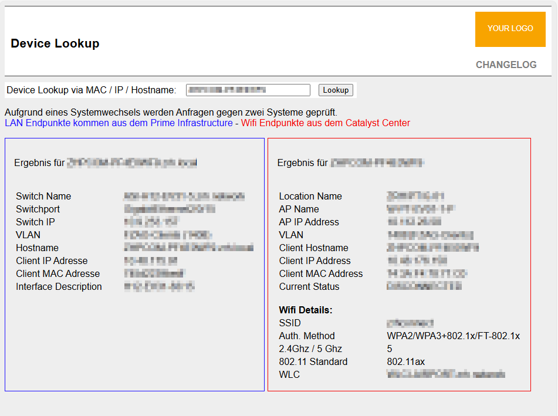

## Tool for Device Lookup @Cisco Prime and @Cisco CatalystCenter
Using this tool, the User doesn't need GUI Access to Prime or Catalyst Center anymore. Specially external contractors can be given "access" to information without let them access your management systems or your core network.

You can check the code and activate/deactivate the lan/wifi part as you like. The given state is:  
LAN is from Prime  
WIFI is from Catalystcenter  

#### This is what it looks like:


No fancy GUI nor beautifier - just a small tool for providing data ;-)


## Compatibility
For now the tested versions are:

`Prime Infrastructure 3.10.5`  
`Catalyst Center: 2.3.7.6 up to 2.3.7.9`


future versions may be tested and updated, keep following.  


## How-To

### 1) vHost Config
the vHost config should be:
<details><summary>Click to expand</summary>

```
<IfModule ssl_module>

<VirtualHost *:443>
        Define FQDN devicelookup.your.domain
        ServerName devicelookup.your.domain
        ServerAlias devicelookup
        SSLEngine On
        ServerAdmin admin@organization.com
        DocumentRoot "/data/vHost/${FQDN}/htdocs"

        # This should be changed to whatever you set DocumentRoot to.
        <Directory "/data/vHost/${FQDN}/htdocs">
                SSLRequireSSL
                Options Indexes FollowSymLinks
                AllowOverride All
                Require all granted
        </Directory>


        <IfModule alias_module>
                ScriptAlias /cgi-bin/ "/data/vHost/${FQDN}/cgi-bin/"
        </IfModule>

        <Directory "/data/vHost/${FQDN}/cgi-bin">
                AllowOverride None
                Options None
                Require all granted
        </Directory>

        ErrorLog /var/log/httpd/${FQDN}_error

        <IfModule log_config_module>
                TransferLog /var/log/httpd/${FQDN}_access
        </IfModule>


        ##########
        # SSL/TLS-Config
        #####
        Include /etc/httpd/vhosts.d/includes/security.include

        ## Per-Server Logging:
        # The home of a custom SSL log file. Use this when you want a compact
        # non-error SSL logfile on a virtual host basis.
        <IfModule log_config_module>
                CustomLog /var/log/httpd/${FQDN}_request_log \
                        "%t %h %{SSL_PROTOCOL}x %{SSL_CIPHER}x \"%r\" %b"
        </IfModule>

        SSLCertificateFile /etc/pki/tls/certs/cert.crt
        SSLCertificateKeyFile /etc/pki/tls/private/private.key

</VirtualHost>
</IfModule>

```
</details>

please make sure to adjust the path for the files and certificate.

### 2) Adjust the Naming Syntax of your devices
to meet the naming syntax feel free to adjust the both files "getPrimeApiDevice.php" and "getCCApiDevice.php". The adjustment can be done within the preg_match:
```
// ADJUST THIS AS YOU NEED
// DEVICE SYNTAX OF YOUR COMPANY
//
        elseif (preg_match('/^(?:[a-zA-Z]{2,9}[0-9]{2,9}|zhpcom\-[A-Za-z0-9]{8})$/i', $DeviceID)) {
                ...
        }
```


### 3) adjust the config files
fill in your config information. There are two files (config.php = prime / configCC.php = CatalystCenter).
Make sure you're using a dedicated API user with the needed rights/limitations.  
